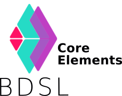

# Bigraph DSL - Core Elements (CE)

This projects contains the following major building blocks of **BDSL**, a bigraphical DSL:
- Grammar, Parser, ...
- Language Server Protocol for IDE implementation support
- Unit tests

IDE support is provided for the following platforms to be more productive when experimenting with BDSL:

- Eclipse, IntelliJ, Visual Code, ... by utilizing the *Language Server Protocol*

This framework provides the core elements on which other frameworks may be based and other applications may be implemented.
Refer to [https://git-st.inf.tu-dresden.de/bigraphs/bigraph-algebraic-interpreter](https://git-st.inf.tu-dresden.de/bigraphs/bigraph-algebraic-interpreter), for instance, where an interpreter for BDSL is implemented.

## Getting Started

Use the following dependency and repository for a Maven-based project:

```xml
<repositories>
    <repository>
    	<id>bintray-st-tu-dresden-maven-repository</id>
        <url>https://dl.bintray.com/st-tu-dresden/maven-repository</url>
	</repository>
</repositories>            

<dependency>
	<groupId>de.tudresden.inf.st.bigraphs.dsl</groupId>
    <artifactId>de.tudresden.inf.st.bigraphs.dsl</artifactId>
    <version>VERSION</version>
    <exclusions>
    	<exclusion>
        	<groupId>de.tudresden.inf.st.bigraphs.dsl</groupId>
            <artifactId>BigraphBaseModel</artifactId>
        </exclusion>
        <exclusion>
        	<groupId>org.eclipse.xtext</groupId>
        	<artifactId>xtext-dev-bom</artifactId>
        </exclusion>
    </exclusions>
</dependency>
```

Replace `VERSION` with the current version.

## Build configuration

To clone this repository, use:

```bash
$ git clone --recursive [url]it
# To update the submodule
$ git submodule update --recursive --remote
```

This will also pull the necessary [Ecore Bigraph Meta Model]() project, which is needed for this Eclipse-based project.

> **Note:** [Ecore Bigraph Meta Model]() is configured as a Git submodule in this project.

### Build everything

```bash
$ ./gradlew clean build
```


#### Generate Xtext Language Artifacts

```bash
$ ./gradlew clean generateXtext
```

#### Generate Language Server Protocol

```bash
$ ./gradlew shadowJar
```
The language server protocol `*.jar` is located under `de.tudresden.inf.st.bigraphs.dsl.ide/build/libs/`.

### Running Tests

The following commands show how to run various kinds of tests:

```bash
# Run all test cases
$ ./gradlew :de.tudresden.inf.st.bigraphs.dsl.tests:test -PwithTests
# All tests within a package
$ ./gradlew test --tests de.tudresden.inf.st.bigraphs.dsl.tests.ide.validation* -PwithTests
# All tests within a class
$ ./gradlew test --tests *BdslAffectionUnitTest -PwithTests
# Only a specific test method
$ ./gradlew test --tests *testSignatureMatchOnAssignment_01 -PwithTests
```

### Artifact Deployment

Execute the following goals to deploy artifacts to [Bintray](https://bintray.com/):
```bash
$ cd de.tudresden.inf.st.bigraphs.dsl
$ ../gradlew bintrayUpload -Dbintray.user=<USER> -Dbintray.key=<API-KEY>
```

An account for Bintray must be created first. 

Further, a working API key is needed and you must join the organization [st-tu-dresden](https://bintray.com/st-tu-dresden) in Bintray.


## Working in Eclipse

This project is best worked with Eclipse. Import everything into a new Eclipse workspace:

- `de.tudresden.inf.st.bigraphs.dsl.parent`
- `BigraphBaseModel` (the cloned Git submodule also contained after following the [Build configuration](#Build-configuration) instructions)
- Old project remnants that don't need to be considered for now: `de.tudresden.inf.st.bigraphs.dsl.ui`
  - Further, `de.tudresden.inf.st.bigraphs.dsl.web` will be discarded soon

You may need to re-generate the model code of the `BigraphBaseModel` project as this process is not currently handled by the gradle script.

You may then be able to run the "MWE2 workflow" and to generate "Xtext artifacts" via the Eclipse IDE inside the `de.tudresden.inf.st.bigraphs.dsl` project, or call the appropriate gradle command as shown above.

### Project Structure

- gradle-based Project
- Language infrastructure for Bigraph DSL (BDSL) based on Xtext is located under `de.tudresden.inf.st.bigraphs.dsl` 
- Language Server Protocol Implementation is located under `de.tudresden.inf.st.bigraphs.dsl.ide`
- Test classes are located under `./de.tudresden.inf.st.bigraphs.dsl.tests/`
  - needs sub-projects `de.tudresden.inf.st.bigraphs.dsl` and `de.tudresden.inf.st.bigraphs.dsl.ide`


